<div align="center">

### `aalvaroo7@github ~ $ whoami`

<table>
<tr>

<td valign="top">

</td>

</tr>
</table>


<br>
<br>


<h3>
<code>aalvaroo7@github ~ $ ./contributions.sh</code>
</h3>




<br>
<br>


<h3>
<code>aalvaroo7@github ~ $ ls ./stack </code>
</h3>


<br>
<br>


<code>
Computer Engineering · Software Development · Artificial Intelligence</code>


</div>

---

### `aalvaroo7@github ~ $ cat about_me.txt`

```txt
Name: Álvaro
Role: Computer Engineering Student
Stack: Python, Java, SQL
Interests: AI, Software Development, Cybersecurity
Location: Spain
```
aalvaroo7@github ~ $ ls skills/
```python
java
sql
git
github
html
css
```
